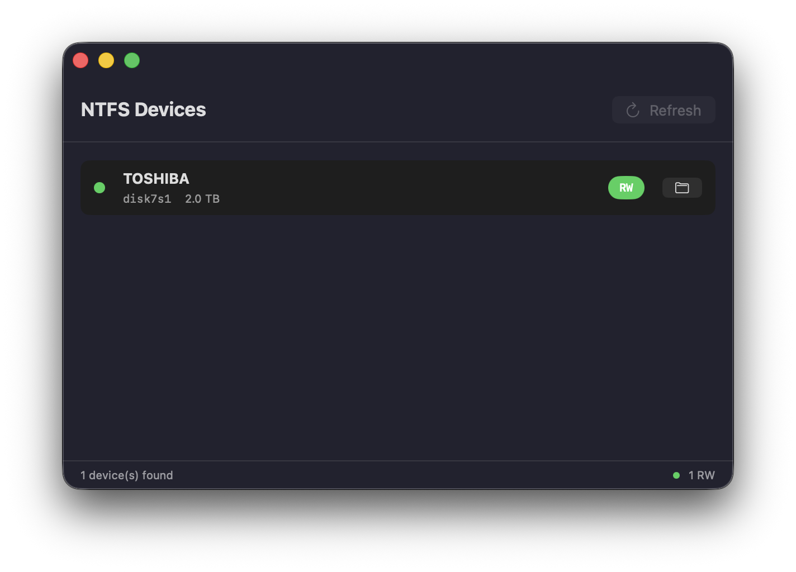

# NTFS4Mac

A lightweight macOS tool for NTFS read/write support. Built with SwiftUI for macOS 14+ (Sonoma, Sequoia, Tahoe).

<p align="center">
English | <a href="README_CN.md">简体中文</a>
</p>



## Features

- **One-click read-write mount** - Remount NTFS volumes via ntfs-3g with a single click
- **Auto device detection** - File system watcher + polling detects new drives in real time
- **Open in Finder** - Quick access to mounted volumes
- **Native macOS experience** - SwiftUI, dark mode, minimal UI
- **CLI included** - Full-featured command-line tool for scripts and automation

## How It Works

macOS natively mounts NTFS volumes as read-only. This tool remounts them in read-write mode using the [ntfs-3g](https://github.com/tuxera/ntfs-3g) driver via [fuse-t](https://github.com/macos-fuse-t/fuse-t).

## Requirements

| OS | Status |
|---|---|
| **macOS 26 (Tahoe)** | Tested |
| **macOS 15 (Sequoia)** | Compatible (untested) |
| **macOS 14 (Sonoma)** | Compatible (untested) |

## Installation

### One-Click Setup

Run this command in Terminal to automatically install all dependencies:

```bash
curl -fsSL https://raw.githubusercontent.com/zhouyeyu/NTFS4Mac/main/setup.sh | bash
```

### Manual Setup

| Dependency | Purpose | Install |
|---|---|---|
| **macOS 14+** | Required | System Settings > Software Update |
| **fuse-t** | File system framework | Download from [fuse-t releases](https://github.com/macos-fuse-t/fuse-t/releases) |
| **ntfs-3g** | NTFS read-write driver | `brew tap gromgit/fuse && brew install ntfs-3g-mac` |

### Install fuse-t

1. Download `fuse-t-macos-installer-X.X.X.pkg` from [fuse-t releases](https://github.com/macos-fuse-t/fuse-t/releases)
2. Double-click to install
3. Grant **Full Disk Access** to `fuse-t.app` in System Settings > Privacy & Security

### Link fuse-t library

After installing fuse-t, link the library for ntfs-3g:

```bash
sudo mv /usr/local/lib/libfuse.2.dylib /usr/local/lib/libfuse.2.dylib.bak
sudo ln -sf libfuse-t.dylib /usr/local/lib/libfuse.2.dylib
```

### Install Application

Download the latest [DMG from Releases](../../releases) and drag `NTFS4Mac.app` to `/Applications`.

Or build from source:

```bash
git clone https://github.com/zhouyeyu/NTFS4Mac.git
cd NTFS4Mac
bash build-dmg.sh
```

### Install CLI Tool

```bash
git clone https://github.com/zhouyeyu/NTFS4Mac.git
cd NTFS4Mac
make install
```

## Usage

### GUI

Launch `NTFS4Mac.app`. Insert an NTFS drive. Click **Mount RW**.

- **RW** (green) = Read-write mode via fuse-t
- **RO** (orange) = Read-only mode (macOS native)
- **--** (gray) = Not mounted

Click the folder icon to open the volume in Finder.

### CLI

```bash
ntfs-cli list               # List all NTFS devices
ntfs-cli mount disk4s1      # Mount as read-write
ntfs-cli unmount disk4s1    # Unmount
ntfs-cli eject disk4s1      # Eject (safe to remove)
ntfs-cli restore disk4s1    # Restore macOS read-only
ntfs-cli watch              # Auto-mount new NTFS devices
ntfs-cli status             # Show mount status
ntfs-cli deps               # Check dependencies
```

## Build

```bash
swift build -c release      # Build GUI app
bash build-dmg.sh           # Build and package DMG
make install PREFIX=/usr/local  # Build CLI only
```

## Project Structure

```
NTFS4Mac/
├── NTFS4Mac/                    # SwiftUI macOS app
│   ├── App/NTFS4MacApp.swift
│   ├── Models/NTFSDevice.swift
│   ├── Services/
│   │   ├── Shell.swift
│   │   ├── DeviceService.swift
│   │   ├── MountService.swift
│   │   └── DeviceWatcher.swift
│   └── Views/
│       ├── DeviceListView.swift
│       └── DeviceRow.swift
├── lib/                         # CLI scripts
├── ntfs-cli.sh                  # CLI entry point
├── setup.sh                     # One-click setup script
├── Package.swift
├── build-dmg.sh
└── Makefile
```

## Known Issues

- **First launch on macOS**: You may need to right-click > Open the app on first launch since it's not signed.

## License

MIT License

Copyright (c) 2026 zhouyeyu

Permission is hereby granted, free of charge, to any person obtaining a copy
of this software and associated documentation files (the "Software"), to deal
in the Software without restriction, including without limitation the rights
to use, copy, modify, merge, publish, distribute, sublicense, and/or sell
copies of the Software, and to permit persons to whom the Software is
furnished to do so, subject to the following conditions:

The above copyright notice and this permission notice shall be included in all
copies or substantial portions of the Software.

THE SOFTWARE IS PROVIDED "AS IS", WITHOUT WARRANTY OF ANY KIND, EXPRESS OR
IMPLIED, INCLUDING BUT NOT LIMITED TO THE WARRANTIES OF MERCHANTABILITY,
FITNESS FOR A PARTICULAR PURPOSE AND NONINFRINGEMENT. IN NO EVENT SHALL THE
AUTHORS OR COPYRIGHT HOLDERS BE LIABLE FOR ANY CLAIM, DAMAGES OR OTHER
LIABILITY, WHETHER IN AN ACTION OF CONTRACT, TORT OR OTHERWISE, ARISING FROM,
OUT OF OR IN CONNECTION WITH THE SOFTWARE OR THE USE OR OTHER DEALINGS IN THE
SOFTWARE.
